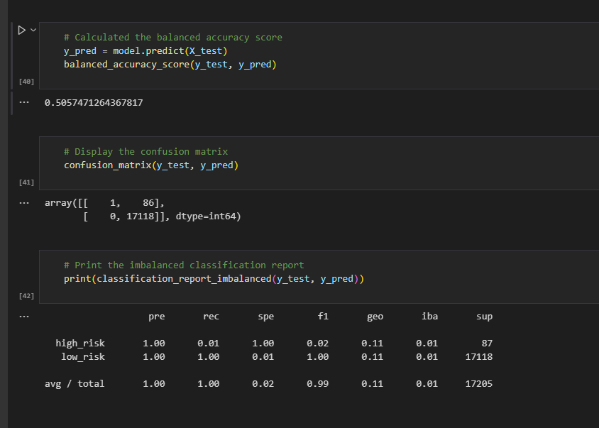
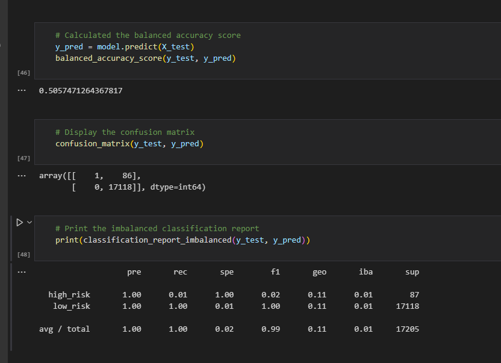
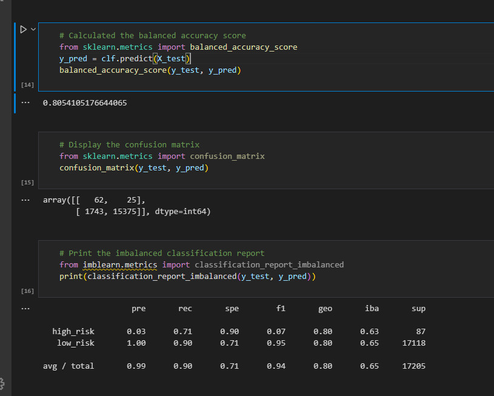

# Credit_Risk_Analysis
# Project Overview
Machine learning helps us learn from data patterns and make predictions using statistical algorithms.  There are three learning categories such as supervised, unsupervised, and deep learning.  This module focused on the supervised learning aspect of machine learning, which can be further divided into regression and classification.  Regression is used to predict continuous variables while classification is used to predict discrete outcomes.  

## *Purpose*
The purpose of this project was to use python and supervised machine learning for classification to build and evaluate different modules that could predict credit risk.

    Models to be tested: 
        Two oversampling algorithms: Naive random oversampling and synthetic minority oversampling technique (SMOTE)
        undersampling algorithm: Cluster Centroids
        Combination over- and under-sampling algorithm:  SMOTE and Edited Nearest Neighbors (ENN) (SMOTEENN)
        Two ensemble algorithms: Forest Classifier and Easy Ensemble AdaBoost classifier

# Results
Tools used for this project include a new machine learning environment with updated  NumPy, SciPy, and Scikit-learn dependencies, an installed imbalanced-learn package and python. 

## Naive random oversampling

The balance accuracy score represents the percentage of predictions that are correct. In this case the naive random oversampling model was accurate 51% of the time.

The confusion matrix shown as an array shows the amount of "True Positives" (top left corner), "False Positives" (bottom left corner), "False Negatives" (top right corner), and "True Negatives" (bottom right corner).  These are the values used to calculate precision, recall, and so on.

The precision (prec) score indicates how reliable a positive classification is.  It is 1 for this module.

The recall (rec) score, which is also known as sensitivity, is a measure of the classifier's ability to find all the positive samples. It is 1 for this module.

## SMOTE

The SMOTE model was accurate 59% of the time.
The precision (prec) was 1 for this module.
The recall (rec) score was 1 for this module.

## Undersampling

This model was accurate 51% of the time.
The precision (prec) was 1 for this module.
The recall (rec) score was 1 for this module.

## Combination over- and under-sampling algorithm

This model was accurate 51% of the time.
The precision (prec) was 1 for this module.
The recall (rec) score was 1 for this module.

## Balanced Forest Classifier

This model was accurate 81% of the time.
The precision (prec) was 1 for this module.
The recall (rec) score was .9 for this module.

## Easy Ensemble AdaBoost classifier

This model was accurate 93% of the time.
The precision (prec) was 1 for this module.
The recall (rec) score was .94 for this module.

# Summary
In summary, the easy ensemble adaboost classifier model was the best model because its accuracy of 0.93, is high.  This means that the model is accurate about 93% of the time.  I would recommend using this model compared to the other ones. However, if other models can be tested, then I would recommend testing other models to find a model with an even higher accuracy score. 

